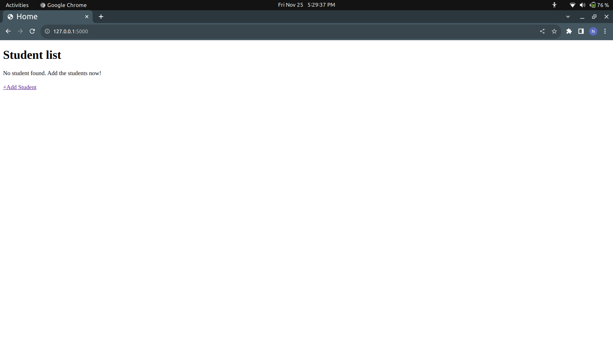
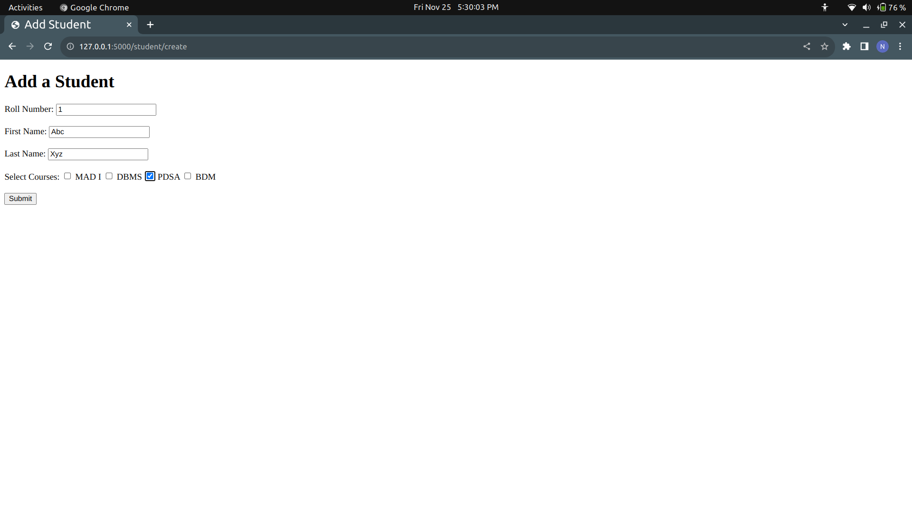
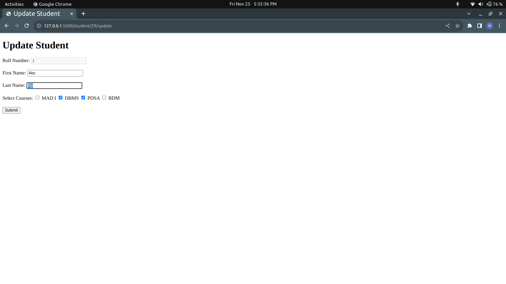

# Student-Management-System

Hi! Welcome to my reposiory, The **Student Management System**. It is developed using **Flask, Bootstrap** and **SQLite3**.


## Functionalities

- You can create new students, you can also select the courses they are currently enrolled in.
- You can view the students details, including their personal and course details.
- You can update the existing students, their personal details and courses they are currently enrolled in **You can't update the roll number**.
- You can delete the existing students.

## Future additions
Currently I am working on the following features
- Adding a search option for both the **course_id** and **student_id**.
- Adding new courses.
- Delete existing courses.

## Setting up the environment

- Download and extract project source code on to your local machine.
- Create a virtual environment. If you don't know how to create one, [click here](https://docs.python.org/3/library/venv.html).
- Open the terminal or powershell, depending upon your os.
- In terminal: ```pip3 install -r requirements.txt```
- Then run this command ```python3 app.py``` to start the flask server.
- Now click on the localhost link provided after running the server.


# Screenshots



***


***


